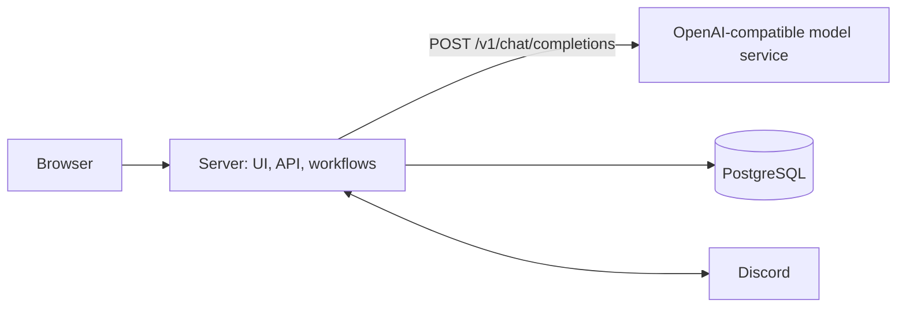

# Three-service architecture

The server owns the UI and workflow logic. A separate model service exposes the
standard OpenAI Chat Completions API. PostgreSQL stores application data and jobs.

| Component | Responsibility |
| --- | --- |
| Server | UI, ingestion, article extraction, scheduling, evaluation prompts, response validation, ranking, feedback learning, Discord delivery |
| Model | Text generation through an OpenAI-compatible endpoint; no application database access |
| Database | Articles, channels, users, feedback, evaluations, delivery records and intents, ingestion runs, workflow jobs, activity history |

## Model interface

Configure `OPENAI_BASE_URL` (including `/v1`), `OPENAI_API_KEY`, and `OPENAI_MODEL`.
The server uses the OpenAI SDK's `chat.completions.create` with standard
`messages` and `response_format: { type: "json_object" }`. The endpoint must support
that JSON mode. The server validates the JSON assessment before calculating and
blending its score. Invalid, truncated, failed, and timed-out responses retain the
base ranking. SDK retries are disabled to keep request time bounded.

The optional Compose `model` service is an unmodified Ollama image. An existing
compatible model endpoint can replace it by changing configuration. There is no
custom inference protocol or gateway wrapper. The old asynchronous Codex gateway
adapter has been removed; `/v1/generate` is not used.

`OPENAI_MODEL_REVISION` is an operator-controlled cache revision. Bump it when
replacing weights behind an unchanged model name. Cache identity also includes
the endpoint, prompt version, article content, profile version, ranking algorithm
version, and blend weight. Model output is not a source of workflow instructions.

## Persistence and concurrency

The production deployment selects PostgreSQL through `DATABASE_URL`.
`PostgresConciergeRepository` implements the existing domain port. SQLite remains
available for legacy local tests and migration sources when that variable is
unset. PostgreSQL migrations are versioned and checksum-verified, and run under
an advisory lock before the container starts serving traffic.

Feedback updates and profile rebuilds execute together under a per-channel
transaction lock. Evaluation writes check the profile version to prevent a slow
model response from overwriting a newer profile's evaluation.

The server takes a PostgreSQL session advisory lock for its lifetime. A second
server fails startup before starting its scheduler or Discord connection. Run
one server and use stop-before-start deployment. If the ownership connection is
lost, the process exits so the deployment platform can restart it.

## Workflows

PostgreSQL-backed ingestion, evaluation, and scheduled delivery jobs live in the
server; there is no separate worker service. Jobs deduplicate while active,
claim atomically, renew a lease, and recover after lease expiry. Failed jobs have
bounded retries with backoff. The initial executor runs one job at a time.

`POST /api/ingestion` returns `202` with a persisted job ID. Dashboard/feed reads
return cached or base scores and schedule semantic evaluation in the background.
The queue UI includes durable jobs and persisted activity. Detailed activity that
was interrupted is marked failed on restart while the parent job is recovered.
The latest 100 activity records and latest 100 jobs are displayed; job records
are retained in PostgreSQL and may need an operational retention policy later.

A durable delivery intent is claimed before a Discord send. A failed/ambiguous
send or interrupted process becomes `uncertain` and blocks automatic resend.
This favors avoiding duplicate messages; uncertain sends require an operator to
check Discord and reconcile the intent. It does not guarantee exactly-once
external delivery. Slash commands remain synchronous interactions with durable
delivery intent protection.

During shutdown the server stops scheduling and claiming work and allows active
work to finish within a 30-second process deadline. Abruptly interrupted jobs
become recoverable after the 60-second lease expires. Model errors degrade
semantic ranking; database errors make the server health endpoint return 503.

## Deployment and migration

See [deployment.md](deployment.md) for local Compose, Coolify, model provisioning,
SQLite import, and cutover instructions. Only the server needs a public domain.
PostgreSQL and model ports remain private in the production Compose definition.
The database and optional model weights use separate persistent volumes.

References: [Coolify Compose](https://coolify.io/docs/applications/builds/docker-compose),
[Ollama OpenAI compatibility](https://docs.ollama.com/api/openai-compatibility),
[OpenAI JSON mode](https://developers.openai.com/api/docs/guides/structured-outputs).
